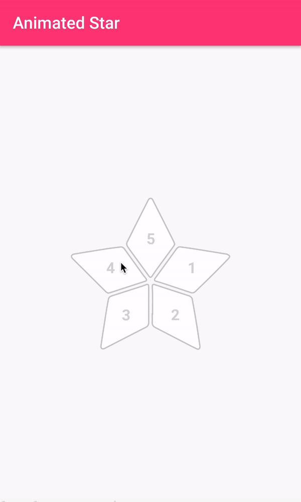

# Animated-Star-Rating

[](https://github.com/zelin/Animated-Star-Rating)
[](https://github.com/zelin/Animated-Star-Rating)
[](https://github.com/zelin/Animated-Star-Rating)
[](http://neberox.tk/donate/?amount=2&currency=USD)



## Installation

The easiest way to add the library to your project is by adding it as a dependency to your build.gradle

```ruby
dependencies {
   implementation 'com.neberox.library:animatedstar:0.0.2'
}
```

## Usage

### Using XML

 ```
  <com.neberox.library.animatedstar.StarRatingBar
        xmlns:app="http://schemas.android.com/apk/res-auto"
        android:layout_width="250dp"
        android:layout_height="250dp"
        android:layout_centerInParent="true"
        app:textPadding="0.5"
        />

```

### Create StarRatingBar programmatically

```java  
RelativeLayout mainLayout = findViewById(R.id.mainView);

RelativeLayout.LayoutParams params = new RelativeLayout.LayoutParams(400, 400);
params.addRule(CENTER_IN_PARENT);
StarRatingBar bar = new StarRatingBar(this);
mainLayout.addView(bar, params);

bar.setAnimDuration(200); //(Optional)
bar.setFillColor(Color.WHITE); //(Optional)
bar.setSelectedColor(Color.parseColor("#f2b01e")); //(Optional)
bar.setStrokeColor(Color.LTGRAY); //(Optional)
bar.setStrokeWidth(1); //(Optional)
bar.setTextPadding(0.5f); //(Optional)
bar.setTextColor(Color.LTGRAY); //(Optional)
bar.setSelectedTextColor(Color.WHITE); //(Optional)
bar.setTextSize(18); //(Optional)

bar.regenerateStar();  //(Compulsory)
```
### Set ratings programmatically

```java
bar.setRating(3);
```

## Attributes

| Name | Description | Default
| ------ | ------ | ------ |
| strokeColor(optional) | Stroke outside each corner. Available only for non rated points | LTGRAY |
| strokeWidth(optional) | Size of the outer stroke | 1dp |
| fillColor(optional) | Color of un rated points of star | WHITE |
| selectedColor | Color of the rated points of star  | #f2b01e |
| textColor(optional) | Color of the text written on each point of star indicating rating | LTGRAY |
| textPadding(optional) | Determines where the text will be drawn either close to corner (1) or close to middle (0). Range 0->1  | 0.5 |
| textSize(optional) | Text font size | 18sp |
| selectedTextColor(optional) | Color of text drawn over the rated points of star | WHITE |

## Potential Improvements
* Creating a float value for rating

## Author

Muhammad Umar, https://github.com/zelin

## License

Animated-Star-Rating is available under the MIT license. See the LICENSE file for more info.
